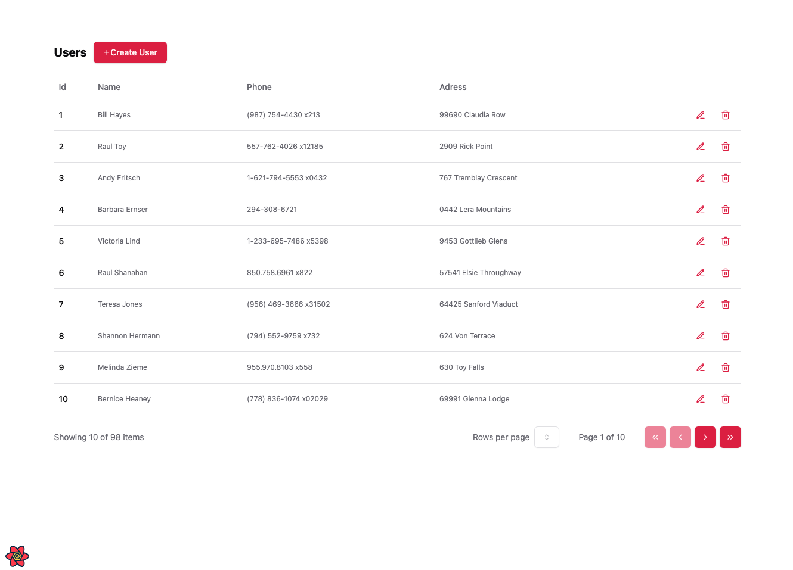

<div align="center">


<h2> React Query -  Queries, Mutations e Query Invalidation 
</h2>

<br>
</div>


Este projeto é uma aplicação para gerenciamento de usuários, que permite criar, listar, editar e deletar usuários, além de contar com funcionalidade de paginação. Foi desenvolvido com React e Vite, utilizando React Query para o gerenciamento de dados e Tailwind CSS para o design responsivo e customizável. A aplicação também integra Axios para requisições HTTP e shadcn/ui para componentes de interface de usuário modernos e acessíveis.

#### React Query

React Query é uma biblioteca poderosa para gerenciar o estado do lado do servidor em aplicações React. Ela lida com a busca, cache, e sincronização de dados com o servidor de forma simples e eficiente. Alguns benefícios incluem: **Cache automático:** Não é necessário gerenciar manualmente o estado local para dados do servidor. **Atualizações em segundo plano:** Os dados são atualizados em segundo plano quando necessário. **Sincronização de estado:** React Query mantém o estado da interface sincronizado com o estado do servidor sem configuração complexa.


- **Queries**: busca de dados através do [useQuery](https://react-query.tanstack.com/reference/useQuery#_top).
- **Mutations**: atualização de dados através do [useMutation](https://react-query.tanstack.com/reference/useMutation#_top).
- **Query Invalidation**: Mantenha suas queries sempre atualizadas de uma forma bem simples através do [Query Invalidation](https://react-query.tanstack.com/guides/query-invalidation#_top).


#### API Mockada com JSON Server
Este projeto utiliza o JSON Server para criar uma API mockada, facilitando o desenvolvimento e testes locais de aplicações front-end ou back-end.


### Tecnologias Utilizadas

- **React:** Biblioteca JavaScript para a construção de interfaces de usuário interativas e reativas.
- **React Query:** Ferramenta poderosa para busca de dados e gerenciamento eficiente de estado do lado do servidor.
- **Axios:** Cliente HTTP baseado em promessas, ideal para fazer requisições tanto no navegador quanto no Node.js.
- **Shadcn/ui:** Framework CSS utilitário que facilita o desenvolvimento rápido e responsivo de interfaces de usuário.
- **Vite:** Ferramenta moderna de build e servidor de desenvolvimento que oferece um desempenho excepcional.
- **JSON Server:** Solução simples e prática para simulação de APIs REST, ideal para desenvolvimento e testes.


## Começando

1. **Clone o repositório**:
    ```bash
    git clone https://github.com/seu-usuario/react-query.git
    cd react-query
    ```

2. **Instale as dependências**:
    ```bash
    npm install
    ```

3. **Execute o JSON Server (para simulação de backend)**:
    ```bash
    npm run server
    ```

4. **Execute o servidor de desenvolvimento**:
    ```bash
    npm run dev
    ```

5. **Construa o projeto**:
    ```bash
    npm run build
    ```

